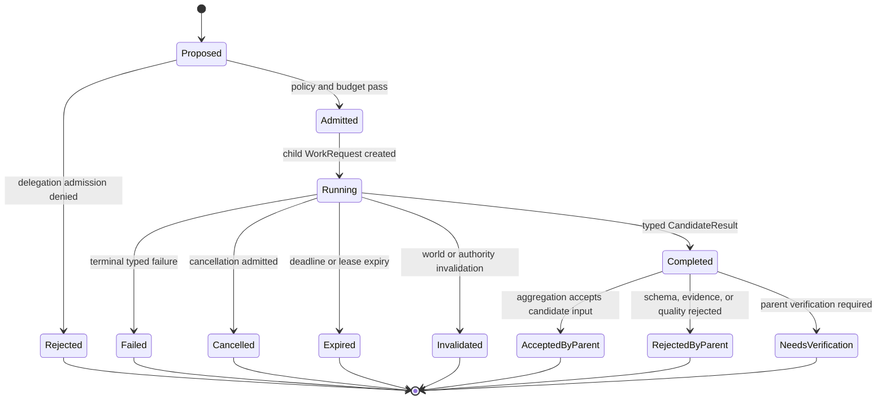

# Dormant Research Contract: Delegation and Child WorkRequest Ontology

Date: 2026-07-19  
Status: dormant research contract  
Implementation authorization: none  
Canonical implementation owner: none until activation  
Program owner: #277  
Related ADR: `docs/adr/2026-07-19-runtime-neutral-agent-governance-kernel.md`  
Related Issues: #284, #287, #291, #439, #440, #442  
Related reference: `docs/architecture/agent-runtime-reference/05-delegation-boundary.md`

## 1. Purpose

This contract defines the question FinHarness must answer before implementing
subagents, multi-Agent orchestration, external Agent delegation, or dynamic
Agent topology:

> Can one governed Agent delegate a bounded, independently verifiable subtask
> without creating a second authority system, a shared mutable responsibility
> history, an unbounded context leak, or an effect path that bypasses the
> FinHarness governance kernel?

This document is deliberately **dormant**.

It does not authorize:

- a multi-Agent runtime;
- recursive subagents;
- Agent-to-Agent protocol support;
- an Agent registry or marketplace;
- dynamic topology learning;
- background schedulers or daemons;
- shared Agent memory;
- new write or execution permissions;
- a second trace, task, receipt, authority, or artifact lifecycle;
- a new implementation Issue before the activation evidence in this contract is
  satisfied.

Its function is to preserve an upgrade path while preventing today's single
Agent work loop from accidentally adopting assumptions that make safe
delegation impossible later.

## 2. Existing Binding Constraints

This contract inherits the following binding architecture decisions and current
FinHarness invariants.

### 2.1 Runtime-neutral governance kernel

The runtime-neutral Agent governance ADR establishes that:

```text
one WorkRequest
→ one canonical AgentRunTrace
```

A provider SDK object, graph checkpoint, handoff record, A2A task, external
Agent transcript, or runtime thread does not become canonical FinHarness history
merely because an external framework persists it.

Models and runtimes may propose transitions. FinHarness owns admission,
dispatch, exact world binding, canonical event ordering, evaluation, stop, and
terminal-state legitimacy.

### 2.2 Server-resolved world

A delegated worker cannot receive a caller-asserted trusted world.

Any future child task must receive a bounded slice derived from an exact
server-resolved `ContextWorld`, including the exact versions relevant to the
subtask.

A child cannot broaden, refresh, or silently substitute its world. Material
world change requires an explicit parent or kernel decision.

### 2.3 Summary is not evidence

The existing delegation reference states:

```text
child summary
→ candidate finding
→ parent verifies referenced evidence
```

A child result is not by itself:

- CapitalState truth;
- admitted evidence;
- a human attestation;
- policy;
- authority;
- approval;
- an execution receipt;
- proof that an effect occurred.

### 2.4 Authority does not flow through topology

Creating, selecting, or connecting an Agent cannot mint authority.

Any delegated capability must be an explicit, bounded subset of authority and
tools already available to the parent run, and may be further restricted by
task-specific policy.

A child cannot:

- approve or reject a governed decision;
- attest on behalf of a human;
- administer mandates or grants;
- widen its capability set;
- create an execution capability;
- transfer funds;
- submit an order;
- rewrite receipts;
- authorize another child merely because it can communicate with one.

## 3. Research Question

The primary research question is:

```text
Does bounded child delegation produce a material, reproducible improvement over
the canonical single-Agent baseline for at least one FinHarness task, after
accounting for correctness, unsupported claims, coordination errors, latency,
cost, context use, replayability, and human review burden?
```

The research is not successful merely because:

- more Agents were used;
- more tokens were consumed;
- more documents were generated;
- parallel execution was faster in one demonstration;
- an external framework produced a visually impressive graph;
- the final prose looked more sophisticated;
- a benchmark score improved without preserving FinHarness governance
  invariants.

## 4. Why This Remains Dormant

Current FinHarness investment order requires the project to establish:

1. one trustworthy Capital World;
2. one minimum Evidence and DecisionCase world;
3. one canonical single-Agent trace, semantic observation path, hydration path,
   DecisionPort, and server-resolved ContextWorld;
4. one read-only internal Agent dogfood task;
5. evaluation evidence showing where the single-Agent system actually fails.

Multi-Agent architecture before those foundations would multiply unresolved
ambiguity:

```text
unclear world
× unclear evidence
× unclear run identity
× unclear stop
× unclear evaluation
× multiple Agents
= more activity, not more governed intelligence
```

The current default remains:

```text
one Agent
one provider path
one WorkRequest
one canonical trace
one-shot or explicitly bounded run
execution_allowed=false
```

## 5. Candidate Ontology

The following ontology is a **research vocabulary**, not an authorized database
schema or implementation API.

If the activation gates are later satisfied, a separate ADR and implementation
Issue must decide exact names, fields, persistence, lifecycle ownership, and
migration.

### 5.1 Root WorkRequest

The user- or system-originated canonical unit of work.

```text
RootWorkRequest
  owns:
    - original goal
    - exact principal and runtime identity
    - exact ContextWorld
    - root budget
    - root stop policy
    - root AgentRunTrace
    - final aggregation and terminal responsibility
```

The root run remains responsible for the final result. A child result cannot
silently become the root result.

### 5.2 DelegationProposal

A typed proposal from the current decision policy requesting a child task.

Candidate fields:

```text
DelegationProposal
  proposal_id
  parent_work_request_ref
  parent_trace_event_ref
  proposed_worker_class
  subtask_objective
  expected_result_contract_ref
  context_slice_policy_ref
  capability_lease_policy_ref
  budget_slice
  deadline_or_stop_policy_ref
  aggregation_policy_ref
  justification
```

A `DelegationProposal` is not proof that a child was created.

### 5.3 DelegationAdmission

The FinHarness kernel decision that validates or rejects the proposal.

Candidate checks:

```text
parent run is active
parent ContextWorld remains valid
subtask is bounded and independently checkable
worker is allowed by policy
context slice is no broader than necessary
capability lease is a strict subset of allowed parent capabilities
budget allocation does not exceed remaining parent budget
recursion depth is permitted
expected result schema is closed and versioned
stop/deadline policy is explicit
no forbidden write/effect capability is present
```

The admission event owns the reason a delegation was accepted or denied.

### 5.4 Child WorkRequest

An admitted delegation creates a new canonical `WorkRequest`.

```text
ChildWorkRequest
  child_work_request_id
  parent_work_request_ref
  delegation_admission_ref
  root_work_request_ref
  delegation_depth
  exact ContextSlice ref
  exact CapabilityLease ref
  exact BudgetSlice ref
  expected result contract ref
  stop/deadline policy ref
  child AgentRunTrace ref
```

The child has its own single canonical trace.

The invariant becomes:

```text
one WorkRequest
→ one canonical AgentRunTrace

one root task
→ zero or more child WorkRequests
→ each child has one trace
```

It does **not** become:

```text
one WorkRequest
→ multiple competing trace roots
```

### 5.5 ContextSlice

A server-produced, immutable, minimum-necessary view derived from the parent's
exact `ContextWorld`.

Candidate contents:

```text
ContextSlice
  context_slice_id
  parent_context_world_ref
  allowed domain-version refs
  allowed evidence/artifact refs
  redacted or excluded classes
  freshness/currentness state
  use restrictions
  schema version
  content hash
```

A child cannot infer access to information omitted from the slice.

A child may request additional context, but that request returns to the parent
or governance kernel for a new admission decision.

### 5.6 CapabilityLease

A temporary, task-bound, revocable permission envelope.

Candidate contents:

```text
CapabilityLease
  lease_id
  parent authority refs
  allowed tool ids and schema versions
  allowed data scopes
  allowed side-effect class
  maximum consequence class
  validity interval
  invocation limits
  egress restrictions
  recursion permission
  human-interaction permission
  revocation state
```

Initial research must require:

```text
allowed side-effect class = read_only
recursion permission = false
human-interaction permission = false
execution_allowed = false
```

A lease is not a new CapitalMandate or AgentAuthorityGrant. It is a narrower
runtime projection derived from existing authority and task policy.

### 5.7 BudgetSlice

A finite allocation from the parent run.

Candidate dimensions:

```text
model tokens
provider cost
wall-clock time
tool invocations
search queries
artifact bytes
maximum iterations
maximum child count
maximum parallelism
```

Unused budget may return to the parent only through a deterministic accounting
rule.

A child cannot borrow additional budget directly from another child.

### 5.8 ExpectedResultContract

A closed result schema defining what the child must return.

Candidate contents:

```text
result type
required source/artifact refs
required unknown/gap reporting
maximum payload size
confidence or quality fields, when meaningful
validation policy
partial-result policy
terminal error taxonomy
```

Examples of valid bounded results:

- candidate counter-evidence with exact source refs;
- duplicate-proposal candidates with comparison keys;
- receipt consistency findings with exact receipt refs;
- a structured research inventory;
- a typed calculation result from an admitted deterministic tool.

An unrestricted prose answer is not sufficient for a governed child contract.

### 5.9 CandidateResult

The child's terminal output.

```text
CandidateResult
  child_work_request_ref
  child_trace_ref
  expected_result_contract_ref
  typed payload or artifact refs
  source/evidence refs
  world-version refs
  partiality and gaps
  terminal classification
  output hash
```

The result is a candidate observation for the parent.

It cannot directly:

- mutate a root plan;
- update CapitalState;
- admit evidence;
- create a DecisionRecord;
- approve an action;
- trigger execution;
- become long-term memory.

### 5.10 AggregationDecision

The parent or a deterministic aggregation policy decides how to consume child
results.

Candidate outcomes:

```text
accept as candidate input
request parent verification
request another bounded child
mark duplicate
mark conflicting
mark insufficient
discard
escalate to human
```

Aggregation must preserve disagreement and source lineage. It must not compress
multiple conflicting child outputs into false consensus.

### 5.11 Cancellation, Expiry, and Revocation

Delegation needs explicit lifecycle events for:

```text
cancel requested
cancel admitted
deadline exceeded
budget exhausted
lease revoked
parent terminated
world invalidated
child failed
child result rejected
```

A parent terminal state must define what happens to active children.

The first research slice should use structured concurrency:

```text
the root cannot silently finish while admitted child work remains unclassified
```

## 6. Candidate State Model



Every transition must be represented in the relevant canonical trace and must
not depend solely on a provider transcript or framework callback.

## 7. Delegation Patterns Under Study

External Agent frameworks commonly expose at least two patterns.

### 7.1 Specialist as bounded tool

A manager retains control and calls a specialist for a bounded subtask.

FinHarness candidate mapping:

```text
parent AgentDecision
→ DelegationProposal
→ admitted ChildWorkRequest
→ typed CandidateResult
→ parent AggregationDecision
```

This is the default research pattern because the root retains final
responsibility.

### 7.2 Handoff or transfer of conversation control

A triage Agent transfers active control to another Agent.

This pattern is **not** the default FinHarness mapping.

A conversation handoff may be useful in user-facing support systems, but it
raises unresolved questions for FinHarness:

- who owns the root WorkResult;
- whether the new Agent receives excessive conversation history;
- whether authority silently follows control;
- whether the original run is terminal or suspended;
- how human interaction and approval are attributed;
- how exact world and budget state are preserved.

Any later handoff experiment must model the transfer explicitly. It cannot use
a framework's native "active agent changed" event as sufficient governance
evidence.

### 7.3 External opaque Agent task

A2A-style systems treat the remote Agent as an opaque service with its own task
lifecycle, capabilities, messages, and artifacts.

FinHarness candidate mapping:

```text
FinHarness ChildWorkRequest
→ protocol adapter
→ external Agent task
→ external messages/artifacts
→ schema/provenance validation
→ FinHarness CandidateResult
```

The external task is referenced evidence of remote work. It is not the
FinHarness `ChildWorkRequest`, canonical trace, authority record, or terminal
truth.

## 8. Research Hypotheses

### H1 — Bounded parallelism helps only decomposable tasks

For tasks with independent, breadth-oriented subtasks, a small number of bounded
children may improve coverage or latency.

For tightly coupled judgment tasks, delegation may increase coordination cost
and reduce quality.

Falsification:

```text
If the delegated system does not materially outperform the single-Agent
baseline on a predeclared decomposable task after cost and review burden are
included, H1 is rejected for that task family.
```

### H2 — Fresh contexts reduce interference but create compression risk

Independent child contexts may reduce path dependence and context competition.

They may also create loss through poor task descriptions, result compression,
or missing shared assumptions.

Falsification:

```text
If child outputs systematically omit information available to the baseline, or
the parent cannot reconstruct source lineage without redoing the task,
delegation is not accepted.
```

### H3 — Typed contracts reduce duplication and uncontrolled exploration

Explicit objective, source policy, tools, output schema, budget, and stop rules
should reduce duplicated work and runaway subtask creation.

Falsification:

```text
If children still duplicate the same evidence paths or exceed bounded work at a
material rate, the delegation policy is inadequate.
```

### H4 — Capability leases contain blast radius

A strict read-only, least-privilege lease should ensure that a child cannot
convert analytical work into domain or execution authority.

Falsification:

```text
Any successful child attempt to access an undeclared tool, broader context,
human approval surface, mutation path, or execution path is a blocking failure.
```

### H5 — Parent aggregation can preserve disagreement

A typed aggregation policy should retain conflicts and uncertainty instead of
producing false consensus.

Falsification:

```text
If contradictory child results are silently averaged, merged, or summarized
without preserved lineage and conflict classification, the aggregation model is
rejected.
```

### H6 — Child traces remain independently replayable

Each child run should hydrate from its canonical trace and artifacts without
re-executing a model, external Agent, or side-effecting tool.

Falsification:

```text
If root inspection requires live access to a child provider/session, or child
replay can repeat an effect, the design is rejected.
```

## 9. Activation Gates

No implementation Issue may be activated until all mandatory gates are
satisfied and recorded in #277 or a newly approved research Issue.

### Gate A — Single-Agent foundation

Required current capabilities:

```text
canonical AgentRunTrace
typed Semantic Observation
side-effect-free hydration/replay
one real DecisionPort
server-resolved ContextWorld
bounded evaluation and stop
read-only internal dogfood task
```

The exact current owners include #291, #439, #440, #287, #284, and the internal
dogfood path ending in #442.

### Gate B — Observed bottleneck

At least one repeated dogfood campaign must show a specific failure plausibly
addressed by delegation, such as:

- breadth coverage is incomplete under the single context budget;
- independent counter-evidence search is consistently missed;
- sequential research latency is materially too high;
- one context cannot preserve both broad evidence gathering and precise
  synthesis;
- a bounded specialist demonstrably needs different tools or instructions.

"Multi-Agent is popular" is not an activation signal.

### Gate C — Decomposable task contract

The candidate task must be divisible into subtasks that are:

```text
bounded
read-only
independently checkable
source-ref preserving
non-overlapping or explicitly conflict-seeking
safe to cancel
safe to retry as a new child WorkRequest
```

### Gate D — Baseline and evaluation corpus

Before implementation, freeze:

- single-Agent baseline;
- task corpus;
- expected result schema;
- correctness rubric;
- unsupported-claim rubric;
- coordination-error taxonomy;
- cost and latency accounting;
- human review-time measure;
- adversarial fixtures.

### Gate E — No authority expansion

The first experiment must enforce:

```text
execution_allowed=false
read-only child tools
no child human interaction
no recursive delegation
no memory writes
no governed proposal mutation
no evidence admission
no policy or authority administration
```

### Gate F — Explicit implementation owner

If Gates A–E pass, create one new bounded implementation Issue under #277.

The Issue must not be folded into:

- #291 canonical trace;
- #287 DecisionPort;
- #284 ContextWorld;
- #290 general Skill policy;
- #300 MCP;
- #288 long-term memory;
- #427 runtime dependency profile.

Those owners may be prerequisites or integration points, but they do not
silently own multi-Agent delegation.

## 10. Minimum Experimental Slice

The first authorized experiment, if any, should be:

```text
one root Agent
one provider family
two child WorkRequests maximum
delegation depth = 1
read-only tools only
one fixed orchestration policy
one task family
one-shot child runs
typed candidate results
parent-controlled aggregation
no public product claim
```

Recommended first task families:

1. Counter-evidence search for a bounded DecisionCase.
2. Independent source verification for a fixed claim set.
3. Receipt or provenance consistency audit.
4. Duplicate proposal or evidence overlap classification.
5. Read-only Capital World audit with independent checks.

Avoid as the first slice:

- open-ended portfolio recommendations;
- automated policy changes;
- transaction planning;
- execution;
- long-running autonomous research with arbitrary child spawning;
- external public Agent discovery;
- cross-organization A2A.

## 11. Evaluation Matrix

| Dimension | Single-Agent baseline | Delegated candidate | Acceptance direction |
| --- | --- | --- | --- |
| Correct findings | measured | measured | material improvement or equal with lower latency |
| Unsupported claims | measured | measured | no increase |
| Missed blockers | measured | measured | no increase; preferably decrease |
| Source lineage completeness | measured | measured | no decrease |
| Duplicate work | measured | measured | bounded and explainable |
| Conflict preservation | measured | measured | all material conflicts retained |
| Total tokens | measured | measured | justified by outcome gain |
| Provider cost | measured | measured | within declared budget |
| Wall-clock latency | measured | measured | improvement for parallel tasks |
| Human review time | measured | measured | no increase unless quality gain justifies it |
| Trace completeness | required | required | 100% |
| Replayability | required | required | 100% without re-execution |
| Authority violations | 0 | 0 | any violation blocks |
| Undeclared tool/context access | 0 | 0 | any violation blocks |
| Orphaned child work | 0 | 0 | any orphan is a defect |
| Cancellation correctness | n/a or measured | measured | deterministic |
| World-version mismatch | 0 | 0 | any mismatch blocks |

A successful demonstration is insufficient. Acceptance requires repeated results
over a frozen corpus and adversarial fixtures.

## 12. Adversarial and Destructive Fixtures

Any implementation proposal must include at least:

1. Child requests a tool not in its lease.
2. Child attempts to broaden its own context.
3. Parent gives two children overlapping tasks and duplication is detected.
4. Two children return contradictory findings.
5. Child returns prose without required source refs.
6. Child returns a result for the wrong world version.
7. Parent world changes while children are running.
8. Parent terminates while a child is active.
9. Child exceeds token, cost, iteration, or deadline budget.
10. Child provider/session disappears before root inspection.
11. External Agent claims completion without a valid typed result.
12. Runtime reports child completion but canonical trace lacks terminal event.
13. Child attempts recursive delegation.
14. Child attempts human approval interaction.
15. Child attempts to write memory or canonical evidence.
16. Cancellation races with terminal completion.
17. Duplicate child creation occurs after retry.
18. Root replay attempts to recontact or re-execute the child.
19. Stale runtime checkpoint conflicts with canonical child trace.
20. A child result attempts to authorize a domain mutation.

## 13. Security and Privacy Questions

Before activation, the implementation proposal must answer:

- What exact data classes may a child receive?
- How is least-privilege context slicing enforced?
- Can secrets or private financial information cross a provider or organization
  boundary?
- How are child egress and external tool use constrained?
- How is capability revocation enforced during a running child task?
- How does the system prevent prompt injection from causing cross-child or
  parent privilege escalation?
- Can one child influence another outside explicit parent mediation?
- How are temporary artifacts deleted or retained?
- What is the maximum blast radius of a compromised child?
- Which failures require immediate parent cancellation or human escalation?

Human permission prompts alone are not considered a sufficient containment
model. Capability and environment boundaries must be mechanically enforced.

## 14. Protocol-Neutrality Requirements

A future implementation may use a mature runtime or protocol, but the canonical
FinHarness contract must not require:

- OpenAI `Agent`, `Handoff`, `RunResult`, or provider message objects;
- Anthropic-specific subagent transcripts;
- AutoGen topics, subscriptions, or message types;
- LangGraph threads or checkpoints;
- A2A `Task`, `AgentCard`, `Message`, or `Artifact` as canonical records;
- provider-managed memory or conversation state.

Adapters may reference and preserve these objects as external artifacts or
operational projections.

Conformance tests must prove that replacing the external implementation does not
change:

```text
WorkRequest identity
ContextSlice semantics
CapabilityLease semantics
Budget accounting
CandidateResult schema
AgentRunTrace ordering
domain admission
authority
effect boundaries
```

## 15. Structured Concurrency Posture

The first implementation should prefer structured parent-child lifetime
semantics:

```text
child lifetime is bounded by the root task
parent knows every admitted child
parent classifies every terminal child outcome
cancellation propagates through an explicit policy
root finalization cannot ignore unclassified child work
```

Detached background Agents remain out of scope.

Long-running async Agents, push notifications, scheduler/daemon ownership, and
cross-session continuation require separate contracts.

## 16. Failure and Rollback Criteria

The experiment must be stopped or reverted if any of the following occurs:

```text
authority violation
undeclared context or tool access
orphaned child WorkRequest
unreplayable root or child trace
implicit effect re-execution
world-version substitution
systematic source-lineage loss
false-consensus aggregation
unbounded recursive spawning
material cost increase without measured quality gain
material human-review burden increase without measured quality gain
provider/runtime object leaks into canonical domain contracts
```

Rollback must remove the delegation adapter and experimental path without
rewriting:

- historical CapitalState;
- EvidenceSet or DecisionCase records;
- mandates or grants;
- canonical single-Agent traces;
- execution records;
- existing runtime-neutral interfaces.

Historical experimental traces may remain readable as explicitly classified
experimental records.

## 17. Decision Rule After Research

After the frozen experiment, one of four decisions must be recorded:

### Adopt

Use bounded child WorkRequests for the proven task family because they improve a
declared product measure without weakening governance.

### Adapt

Retain only a narrower pattern, such as deterministic parallel tool calls,
independent evaluator passes, or manager-controlled specialist tools.

### Reject

Keep the single-Agent path because coordination, cost, review burden, or
governance risk outweighs the benefit.

### Continue Research

Run another bounded experiment only when the previous result identifies a
specific unresolved variable. Do not continue because multi-Agent architecture
is strategically fashionable.

## 18. Non-Goals

This contract does not define:

- a generic organization chart of Agents;
- permanent Agent roles or personas;
- an Agent marketplace;
- dynamic topology optimization;
- learned delegation policies;
- collective memory;
- cross-Agent hidden-state sharing;
- consensus voting as truth;
- swarm intelligence;
- autonomous hiring or creation of Agents;
- recursive self-improvement;
- public A2A compatibility;
- live capital execution;
- a general distributed workflow engine.

## 19. Open Research Questions

1. Should a child always use a fresh model context, or may it receive a
   summarized parent transcript?
2. Which context classes may be copied versus referenced?
3. Is a `CapabilityLease` a projection of an existing grant, a distinct
   OperationReceipt, or both?
4. How should budget return and unused allocation be represented?
5. How should parent and child cancellation races resolve deterministically?
6. Can deterministic tools run in parallel without using child Agents?
7. Which task families benefit from heterogeneous models rather than identical
   copies?
8. How should independent results be aggregated without Goodhart-style voting?
9. When should a child result become an EvidenceClaim candidate?
10. How should external Agent identity be authenticated without treating
    authentication as FinHarness authority?
11. Should external task artifacts be copied into the Artifact Store or retained
    by immutable reference?
12. What is the minimum telemetry needed to diagnose coordination failures
    without making telemetry canonical?
13. What exact evidence would justify delegation depth greater than one?
14. Can the same ontology support human-delegated subtasks without conflating
    human and Agent authority?
15. What long-running or asynchronous semantics would require a separate
    scheduler contract?

## 20. Confirmation

This research contract is serving its purpose while all of the following remain
true:

```text
The current single-Agent architecture does not require multi-Agent code.

No runtime framework's handoff or subagent object becomes canonical FinHarness
state.

Future delegation has an explicit path that preserves one trace per
WorkRequest.

A child cannot inherit broader world, tool, authority, budget, memory, or human
interaction access implicitly.

The project has measurable activation gates rather than a roadmap promise.

A future multi-Agent experiment can be removed without migrating domain truth.
```

## 21. Suggested Future Issue Shape

Only after the activation gates pass, create a new child Issue under #277 with a
bounded title such as:

```text
AR-DELEGATE-01:
Run one read-only child WorkRequest under an admitted context, capability,
budget, and result contract
```

The Issue should own exactly one vertical slice:

```text
DelegationProposal
→ admission
→ one ChildWorkRequest
→ one child AgentRunTrace
→ one typed CandidateResult
→ parent AggregationDecision
```

It should not simultaneously implement:

- external A2A;
- dynamic topology;
- recursive delegation;
- long-term memory;
- general Skills;
- multiple providers;
- scheduler/daemon execution;
- public product surfaces;
- write or execution capabilities.

## 22. References

### FinHarness

- Runtime-neutral Agent governance kernel ADR:
  `docs/adr/2026-07-19-runtime-neutral-agent-governance-kernel.md`
- Delegation reference:
  `docs/architecture/agent-runtime-reference/05-delegation-boundary.md`
- Program and investment gates:
  https://github.com/zycxfyh/FinHarness/issues/277
- Canonical AgentRunTrace:
  https://github.com/zycxfyh/FinHarness/issues/291
- Server-resolved ContextWorld:
  https://github.com/zycxfyh/FinHarness/issues/284
- Primary model DecisionPort:
  https://github.com/zycxfyh/FinHarness/issues/287
- Typed Semantic Observation:
  https://github.com/zycxfyh/FinHarness/issues/439
- Hydration and replay:
  https://github.com/zycxfyh/FinHarness/issues/440
- Internal read-only dogfood:
  https://github.com/zycxfyh/FinHarness/issues/442

### External primary references

- OpenAI Agents SDK, Agent orchestration:
  https://openai.github.io/openai-agents-python/multi_agent/
- OpenAI Agents SDK, Handoffs:
  https://openai.github.io/openai-agents-python/handoffs/
- OpenAI Agents SDK, Agents as tools:
  https://openai.github.io/openai-agents-python/tools/
- Anthropic Engineering, How we built our multi-agent research system:
  https://www.anthropic.com/engineering/multi-agent-research-system
- Anthropic Engineering, How we contain Claude across products:
  https://www.anthropic.com/engineering/how-we-contain-claude
- A2A Protocol 1.0 specification:
  https://a2a-protocol.org/dev/specification/
- Microsoft AutoGen, Handoffs:
  https://microsoft.github.io/autogen/stable/user-guide/core-user-guide/design-patterns/handoffs.html
