# Repo Intelligence

Generated at: `2026-06-04T08:43:55Z`

## Summary

- Files: `332`
- Total lines: `68356`
- Execution allowed: `false`

## Changed Surface

- `Taskfile.yml`
- `data/security/`
- `docs/architecture/generated/repo-intelligence.md`
- `docs/security/openssf-scorecard-roadmap.md`
- `docs/security/sbom-and-provenance.md`
- `docs/security/ssdf-control-map.md`
- `package.json`
- `scripts/generate_security_sbom.py`
- `tests/test_security_sbom.py`

## Required Checks

- `task check`
- `task hardening:gate`

## Mermaid

```mermaid
flowchart LR
  n_src_finharness___init___py["__init__.py"]
  n_src_finharness_agent_tools_py["agent_tools.py"]
  n_src_finharness_alpaca_client_py["alpaca_client.py"]
  n_src_finharness_backtrader_runner_py["backtrader_runner.py"]
  n_src_finharness_cognitive_graph_py["cognitive_graph.py"]
  n_src_finharness_daily_evidence_py["daily_evidence.py"]
  n_src_finharness_daily_evidence_graph_py["daily_evidence_graph.py"]
  n_src_finharness_data_entry_py["data_entry.py"]
  n_src_finharness_engineering_delivery_graph_py["engineering_delivery_graph.py"]
  n_src_finharness_events_py["events.py"]
  n_src_finharness_events_graph_py["events_graph.py"]
  n_src_finharness_execution_py["execution.py"]
  n_src_finharness_execution_graph_py["execution_graph.py"]
  n_src_finharness_governance_dashboard_py["governance_dashboard.py"]
  n_src_finharness_governance_dashboard_graph_py["governance_dashboard_graph.py"]
  n_src_finharness_hardening_py["hardening.py"]
  n_src_finharness_hypotheses_py["hypotheses.py"]
  n_src_finharness_hypotheses_graph_py["hypotheses_graph.py"]
  n_src_finharness_indicator_graph_py["indicator_graph.py"]
  n_src_finharness_indicator_layer_py["indicator_layer.py"]
  n_src_finharness_indicators___init___py["indicators/__init__.py"]
  n_src_finharness_indicators_macd_py["indicators/macd.py"]
  n_src_finharness_indicators_shared_py["indicators/shared.py"]
  n_src_finharness_indicators_smc_py["indicators/smc.py"]
  n_src_finharness_indicators_squeeze_py["indicators/squeeze.py"]
  n_src_finharness_interpretation_py["interpretation.py"]
  n_src_finharness_interpretation_graph_py["interpretation_graph.py"]
  n_src_finharness_market_data_py["market_data.py"]
  n_src_finharness_market_data_graph_py["market_data_graph.py"]
  n_src_finharness_metrics_py["metrics.py"]
  n_src_finharness_okx_cli_py["okx_cli.py"]
  n_src_finharness_post_trade_py["post_trade.py"]
  n_src_finharness_post_trade_graph_py["post_trade_graph.py"]
  n_src_finharness_proposal_py["proposal.py"]
  n_src_finharness_proposal_graph_py["proposal_graph.py"]
  n_src_finharness_providers___init___py["providers/__init__.py"]
  n_src_finharness_providers_ccxt_provider_py["providers/ccxt_provider.py"]
  n_src_finharness_quality_governance_graph_py["quality_governance_graph.py"]
  n_src_finharness_release_preflight_graph_py["release_preflight_graph.py"]
  n_src_finharness_repo_intelligence_py["repo_intelligence.py"]
  n_src_finharness_repo_intelligence_graph_py["repo_intelligence_graph.py"]
  n_src_finharness_research_assets_py["research_assets.py"]
  n_src_finharness_risk_gate_py["risk_gate.py"]
  n_src_finharness_risk_gate_graph_py["risk_gate_graph.py"]
  n_src_finharness_ten_layer_graph_py["ten_layer_graph.py"]
  n_src_finharness_trading_guard_py["trading_guard.py"]
  n_src_finharness_validation_py["validation.py"]
  n_src_finharness_validation_graph_py["validation_graph.py"]
  n_src_finharness_workflow_py["workflow.py"]
  n_src_finharness_agent_tools_py --> n_src_finharness_data_entry_py
  n_src_finharness_agent_tools_py --> n_src_finharness_metrics_py
  n_src_finharness_daily_evidence_py --> n_src_finharness_market_data_py
  n_src_finharness_daily_evidence_graph_py --> n_src_finharness_daily_evidence_py
  n_src_finharness_daily_evidence_graph_py --> n_src_finharness_events_py
  n_src_finharness_daily_evidence_graph_py --> n_src_finharness_events_graph_py
  n_src_finharness_daily_evidence_graph_py --> n_src_finharness_indicator_graph_py
  n_src_finharness_daily_evidence_graph_py --> n_src_finharness_interpretation_graph_py
  n_src_finharness_daily_evidence_graph_py --> n_src_finharness_market_data_graph_py
  n_src_finharness_events_py --> n_src_finharness_market_data_py
  n_src_finharness_events_graph_py --> n_src_finharness_events_py
  n_src_finharness_execution_py --> n_src_finharness_market_data_py
  n_src_finharness_execution_py --> n_src_finharness_risk_gate_py
  n_src_finharness_execution_graph_py --> n_src_finharness_execution_py
  n_src_finharness_execution_graph_py --> n_src_finharness_research_assets_py
  n_src_finharness_execution_graph_py --> n_src_finharness_risk_gate_py
  n_src_finharness_execution_graph_py --> n_src_finharness_risk_gate_graph_py
  n_src_finharness_governance_dashboard_py --> n_src_finharness_release_preflight_graph_py
  n_src_finharness_governance_dashboard_py --> n_src_finharness_repo_intelligence_py
  n_src_finharness_governance_dashboard_py --> n_src_finharness_repo_intelligence_graph_py
  n_src_finharness_governance_dashboard_graph_py --> n_src_finharness_governance_dashboard_py
  n_src_finharness_governance_dashboard_graph_py --> n_src_finharness_repo_intelligence_py
  n_src_finharness_hypotheses_py --> n_src_finharness_interpretation_py
  n_src_finharness_hypotheses_py --> n_src_finharness_market_data_py
  n_src_finharness_hypotheses_graph_py --> n_src_finharness_hypotheses_py
  n_src_finharness_hypotheses_graph_py --> n_src_finharness_interpretation_py
  n_src_finharness_hypotheses_graph_py --> n_src_finharness_interpretation_graph_py
  n_src_finharness_hypotheses_graph_py --> n_src_finharness_research_assets_py
  n_src_finharness_indicator_graph_py --> n_src_finharness_indicator_layer_py
  n_src_finharness_indicator_graph_py --> n_src_finharness_market_data_py
  n_src_finharness_indicator_graph_py --> n_src_finharness_market_data_graph_py
  n_src_finharness_indicator_layer_py --> n_src_finharness_indicators_shared_py
  n_src_finharness_indicator_layer_py --> n_src_finharness_market_data_py
  n_src_finharness_indicators___init___py --> n_src_finharness_indicators_macd_py
  n_src_finharness_indicators___init___py --> n_src_finharness_indicators_shared_py
  n_src_finharness_indicators___init___py --> n_src_finharness_indicators_smc_py
  n_src_finharness_indicators___init___py --> n_src_finharness_indicators_squeeze_py
  n_src_finharness_indicators_macd_py --> n_src_finharness_indicators_shared_py
  n_src_finharness_indicators_smc_py --> n_src_finharness_indicators_shared_py
  n_src_finharness_indicators_squeeze_py --> n_src_finharness_indicators_shared_py
  n_src_finharness_interpretation_py --> n_src_finharness_events_py
  n_src_finharness_interpretation_py --> n_src_finharness_market_data_py
  n_src_finharness_interpretation_graph_py --> n_src_finharness_events_py
  n_src_finharness_interpretation_graph_py --> n_src_finharness_events_graph_py
  n_src_finharness_interpretation_graph_py --> n_src_finharness_interpretation_py
  n_src_finharness_market_data_graph_py --> n_src_finharness_data_entry_py
  n_src_finharness_market_data_graph_py --> n_src_finharness_market_data_py
  n_src_finharness_post_trade_py --> n_src_finharness_execution_py
  n_src_finharness_post_trade_py --> n_src_finharness_market_data_py
  n_src_finharness_post_trade_graph_py --> n_src_finharness_execution_py
  n_src_finharness_post_trade_graph_py --> n_src_finharness_execution_graph_py
  n_src_finharness_post_trade_graph_py --> n_src_finharness_post_trade_py
  n_src_finharness_post_trade_graph_py --> n_src_finharness_research_assets_py
  n_src_finharness_proposal_py --> n_src_finharness_market_data_py
  n_src_finharness_proposal_py --> n_src_finharness_validation_py
  n_src_finharness_proposal_graph_py --> n_src_finharness_proposal_py
  n_src_finharness_proposal_graph_py --> n_src_finharness_research_assets_py
  n_src_finharness_proposal_graph_py --> n_src_finharness_validation_py
  n_src_finharness_proposal_graph_py --> n_src_finharness_validation_graph_py
  n_src_finharness_providers_ccxt_provider_py --> n_src_finharness_market_data_py
  n_src_finharness_quality_governance_graph_py --> n_src_finharness_repo_intelligence_py
  n_src_finharness_quality_governance_graph_py --> n_src_finharness_repo_intelligence_graph_py
  n_src_finharness_release_preflight_graph_py --> n_src_finharness_quality_governance_graph_py
  n_src_finharness_release_preflight_graph_py --> n_src_finharness_repo_intelligence_py
  n_src_finharness_repo_intelligence_graph_py --> n_src_finharness_repo_intelligence_py
  n_src_finharness_research_assets_py --> n_src_finharness_market_data_py
  n_src_finharness_risk_gate_py --> n_src_finharness_market_data_py
  n_src_finharness_risk_gate_py --> n_src_finharness_proposal_py
  n_src_finharness_risk_gate_graph_py --> n_src_finharness_proposal_py
  n_src_finharness_risk_gate_graph_py --> n_src_finharness_proposal_graph_py
  n_src_finharness_risk_gate_graph_py --> n_src_finharness_research_assets_py
  n_src_finharness_risk_gate_graph_py --> n_src_finharness_risk_gate_py
  n_src_finharness_ten_layer_graph_py --> n_src_finharness_events_graph_py
  n_src_finharness_ten_layer_graph_py --> n_src_finharness_execution_graph_py
  n_src_finharness_ten_layer_graph_py --> n_src_finharness_hypotheses_graph_py
  n_src_finharness_ten_layer_graph_py --> n_src_finharness_indicator_graph_py
  n_src_finharness_ten_layer_graph_py --> n_src_finharness_interpretation_graph_py
  n_src_finharness_ten_layer_graph_py --> n_src_finharness_market_data_graph_py
  n_src_finharness_ten_layer_graph_py --> n_src_finharness_post_trade_graph_py
  n_src_finharness_ten_layer_graph_py --> n_src_finharness_proposal_graph_py
```

