# Repo Intelligence

Generated at: `2026-06-16T14:37:49Z`

## Summary

- Files: `447`
- Total lines: `87648`
- Execution allowed: `false`

## Changed Surface

- `docs/architecture/generated/repo-intelligence.md`
- `docs/architecture/research-rigor-ladder-spec.md`
- `docs/reference/receipts.md`
- `src/finharness/data_entry.py`
- `src/finharness/market_data.py`
- `src/finharness/market_data_graph.py`
- `src/finharness/ten_layer_graph.py`
- `src/finharness/validation.py`
- `src/finharness/workflow.py`
- `tests/test_data_entry.py`
- `tests/test_market_data.py`
- `tests/test_market_data_graph.py`
- `tests/test_validation.py`

## Required Checks

- `task check`
- `task hardening:gate`

## Mermaid

```mermaid
flowchart LR
  n_src_finharness___init___py["__init__.py"]
  n_src_finharness_agent_tools_py["agent_tools.py"]
  n_src_finharness_alpaca_client_py["alpaca_client.py"]
  n_src_finharness_backtrader_runner_py["backtrader_runner.py"]
  n_src_finharness_cognitive_graph_py["cognitive_graph.py"]
  n_src_finharness_daily_evidence_py["daily_evidence.py"]
  n_src_finharness_daily_evidence_graph_py["daily_evidence_graph.py"]
  n_src_finharness_data_entry_py["data_entry.py"]
  n_src_finharness_data_quality_py["data_quality.py"]
  n_src_finharness_effective_rules_py["effective_rules.py"]
  n_src_finharness_engineering_delivery_graph_py["engineering_delivery_graph.py"]
  n_src_finharness_events_py["events.py"]
  n_src_finharness_events_graph_py["events_graph.py"]
  n_src_finharness_execution_py["execution.py"]
  n_src_finharness_execution_graph_py["execution_graph.py"]
  n_src_finharness_governance_dashboard_py["governance_dashboard.py"]
  n_src_finharness_governance_dashboard_graph_py["governance_dashboard_graph.py"]
  n_src_finharness_hardening_py["hardening.py"]
  n_src_finharness_hermes_bridge_py["hermes_bridge.py"]
  n_src_finharness_hypotheses_py["hypotheses.py"]
  n_src_finharness_hypotheses_graph_py["hypotheses_graph.py"]
  n_src_finharness_indicator_graph_py["indicator_graph.py"]
  n_src_finharness_indicator_layer_py["indicator_layer.py"]
  n_src_finharness_indicators___init___py["indicators/__init__.py"]
  n_src_finharness_indicators_macd_py["indicators/macd.py"]
  n_src_finharness_indicators_shared_py["indicators/shared.py"]
  n_src_finharness_indicators_smc_py["indicators/smc.py"]
  n_src_finharness_indicators_squeeze_py["indicators/squeeze.py"]
  n_src_finharness_interpretation_py["interpretation.py"]
  n_src_finharness_interpretation_graph_py["interpretation_graph.py"]
  n_src_finharness_lesson_loop_py["lesson_loop.py"]
  n_src_finharness_market_cockpit_py["market_cockpit.py"]
  n_src_finharness_market_data_py["market_data.py"]
  n_src_finharness_market_data_graph_py["market_data_graph.py"]
  n_src_finharness_metrics_py["metrics.py"]
  n_src_finharness_okx_cli_py["okx_cli.py"]
  n_src_finharness_okx_live_gate_py["okx_live_gate.py"]
  n_src_finharness_okx_policy_py["okx_policy.py"]
  n_src_finharness_okx_redaction_py["okx_redaction.py"]
  n_src_finharness_okx_symbols_py["okx_symbols.py"]
  n_src_finharness_portfolio_risk_py["portfolio_risk.py"]
  n_src_finharness_post_trade_py["post_trade.py"]
  n_src_finharness_post_trade_graph_py["post_trade_graph.py"]
  n_src_finharness_project_governance_adapter_py["project_governance_adapter.py"]
  n_src_finharness_proposal_py["proposal.py"]
  n_src_finharness_proposal_graph_py["proposal_graph.py"]
  n_src_finharness_providers___init___py["providers/__init__.py"]
  n_src_finharness_providers_ccxt_provider_py["providers/ccxt_provider.py"]
  n_src_finharness_quality_governance_graph_py["quality_governance_graph.py"]
  n_src_finharness_receipt_usage_audit_py["receipt_usage_audit.py"]
  n_src_finharness_release_preflight_graph_py["release_preflight_graph.py"]
  n_src_finharness_repo_intelligence_py["repo_intelligence.py"]
  n_src_finharness_repo_intelligence_graph_py["repo_intelligence_graph.py"]
  n_src_finharness_research_assets_py["research_assets.py"]
  n_src_finharness_research_rigor_py["research_rigor.py"]
  n_src_finharness_risk_gate_py["risk_gate.py"]
  n_src_finharness_risk_gate_graph_py["risk_gate_graph.py"]
  n_src_finharness_rule_change_ledger_py["rule_change_ledger.py"]
  n_src_finharness_ten_layer_graph_py["ten_layer_graph.py"]
  n_src_finharness_trading_guard_py["trading_guard.py"]
  n_src_finharness_trading_state_store_py["trading_state_store.py"]
  n_src_finharness_validation_py["validation.py"]
  n_src_finharness_validation_graph_py["validation_graph.py"]
  n_src_finharness_validation_metrics_py["validation_metrics.py"]
  n_src_finharness_vectorbt_runner_py["vectorbt_runner.py"]
  n_src_finharness_workflow_py["workflow.py"]
  n_src_finharness_agent_tools_py --> n_src_finharness_data_entry_py
  n_src_finharness_agent_tools_py --> n_src_finharness_metrics_py
  n_src_finharness_daily_evidence_py --> n_src_finharness_market_data_py
  n_src_finharness_daily_evidence_graph_py --> n_src_finharness_daily_evidence_py
  n_src_finharness_daily_evidence_graph_py --> n_src_finharness_events_py
  n_src_finharness_daily_evidence_graph_py --> n_src_finharness_events_graph_py
  n_src_finharness_daily_evidence_graph_py --> n_src_finharness_indicator_graph_py
  n_src_finharness_daily_evidence_graph_py --> n_src_finharness_interpretation_graph_py
  n_src_finharness_daily_evidence_graph_py --> n_src_finharness_market_data_graph_py
  n_src_finharness_effective_rules_py --> n_src_finharness_rule_change_ledger_py
  n_src_finharness_effective_rules_py --> n_src_finharness_trading_guard_py
  n_src_finharness_events_py --> n_src_finharness_market_data_py
  n_src_finharness_events_graph_py --> n_src_finharness_events_py
  n_src_finharness_execution_py --> n_src_finharness_market_data_py
  n_src_finharness_execution_py --> n_src_finharness_risk_gate_py
  n_src_finharness_execution_graph_py --> n_src_finharness_execution_py
  n_src_finharness_execution_graph_py --> n_src_finharness_research_assets_py
  n_src_finharness_execution_graph_py --> n_src_finharness_risk_gate_py
  n_src_finharness_execution_graph_py --> n_src_finharness_risk_gate_graph_py
  n_src_finharness_governance_dashboard_py --> n_src_finharness_release_preflight_graph_py
  n_src_finharness_governance_dashboard_py --> n_src_finharness_repo_intelligence_py
  n_src_finharness_governance_dashboard_py --> n_src_finharness_repo_intelligence_graph_py
  n_src_finharness_governance_dashboard_graph_py --> n_src_finharness_governance_dashboard_py
  n_src_finharness_governance_dashboard_graph_py --> n_src_finharness_repo_intelligence_py
  n_src_finharness_hypotheses_py --> n_src_finharness_hermes_bridge_py
  n_src_finharness_hypotheses_py --> n_src_finharness_interpretation_py
  n_src_finharness_hypotheses_py --> n_src_finharness_market_data_py
  n_src_finharness_hypotheses_graph_py --> n_src_finharness_hypotheses_py
  n_src_finharness_hypotheses_graph_py --> n_src_finharness_interpretation_py
  n_src_finharness_hypotheses_graph_py --> n_src_finharness_interpretation_graph_py
  n_src_finharness_hypotheses_graph_py --> n_src_finharness_research_assets_py
  n_src_finharness_indicator_graph_py --> n_src_finharness_indicator_layer_py
  n_src_finharness_indicator_graph_py --> n_src_finharness_market_data_py
  n_src_finharness_indicator_graph_py --> n_src_finharness_market_data_graph_py
  n_src_finharness_indicator_layer_py --> n_src_finharness_indicators_shared_py
  n_src_finharness_indicator_layer_py --> n_src_finharness_market_data_py
  n_src_finharness_indicators___init___py --> n_src_finharness_indicators_macd_py
  n_src_finharness_indicators___init___py --> n_src_finharness_indicators_shared_py
  n_src_finharness_indicators___init___py --> n_src_finharness_indicators_smc_py
  n_src_finharness_indicators___init___py --> n_src_finharness_indicators_squeeze_py
  n_src_finharness_indicators_macd_py --> n_src_finharness_indicators_shared_py
  n_src_finharness_indicators_shared_py --> n_src_finharness___init___py
  n_src_finharness_indicators_smc_py --> n_src_finharness_indicators_shared_py
  n_src_finharness_indicators_squeeze_py --> n_src_finharness_indicators_shared_py
  n_src_finharness_interpretation_py --> n_src_finharness_events_py
  n_src_finharness_interpretation_py --> n_src_finharness_market_data_py
  n_src_finharness_interpretation_graph_py --> n_src_finharness_events_py
  n_src_finharness_interpretation_graph_py --> n_src_finharness_events_graph_py
  n_src_finharness_interpretation_graph_py --> n_src_finharness_interpretation_py
  n_src_finharness_lesson_loop_py --> n_src_finharness_hermes_bridge_py
  n_src_finharness_lesson_loop_py --> n_src_finharness_market_data_py
  n_src_finharness_market_cockpit_py --> n_src_finharness_indicator_graph_py
  n_src_finharness_market_cockpit_py --> n_src_finharness_market_data_py
  n_src_finharness_market_cockpit_py --> n_src_finharness_market_data_graph_py
  n_src_finharness_market_cockpit_py --> n_src_finharness_metrics_py
  n_src_finharness_market_cockpit_py --> n_src_finharness_receipt_usage_audit_py
  n_src_finharness_market_data_py --> n_src_finharness_data_quality_py
  n_src_finharness_market_data_graph_py --> n_src_finharness_data_entry_py
  n_src_finharness_market_data_graph_py --> n_src_finharness_market_data_py
  n_src_finharness_okx_cli_py --> n_src_finharness_okx_policy_py
  n_src_finharness_okx_cli_py --> n_src_finharness_okx_redaction_py
  n_src_finharness_okx_cli_py --> n_src_finharness_okx_symbols_py
  n_src_finharness_okx_live_gate_py --> n_src_finharness_effective_rules_py
  n_src_finharness_okx_live_gate_py --> n_src_finharness_market_data_py
  n_src_finharness_okx_live_gate_py --> n_src_finharness_okx_cli_py
  n_src_finharness_okx_live_gate_py --> n_src_finharness_trading_guard_py
  n_src_finharness_okx_live_gate_py --> n_src_finharness_trading_state_store_py
  n_src_finharness_post_trade_py --> n_src_finharness_execution_py
  n_src_finharness_post_trade_py --> n_src_finharness_market_data_py
  n_src_finharness_post_trade_graph_py --> n_src_finharness_execution_py
  n_src_finharness_post_trade_graph_py --> n_src_finharness_execution_graph_py
  n_src_finharness_post_trade_graph_py --> n_src_finharness_post_trade_py
  n_src_finharness_post_trade_graph_py --> n_src_finharness_research_assets_py
  n_src_finharness_post_trade_graph_py --> n_src_finharness_trading_state_store_py
  n_src_finharness_project_governance_adapter_py --> n_src_finharness_repo_intelligence_py
  n_src_finharness_proposal_py --> n_src_finharness_market_data_py
  n_src_finharness_proposal_py --> n_src_finharness_validation_py
  n_src_finharness_proposal_graph_py --> n_src_finharness_proposal_py
  n_src_finharness_proposal_graph_py --> n_src_finharness_research_assets_py
  n_src_finharness_proposal_graph_py --> n_src_finharness_validation_py
```

