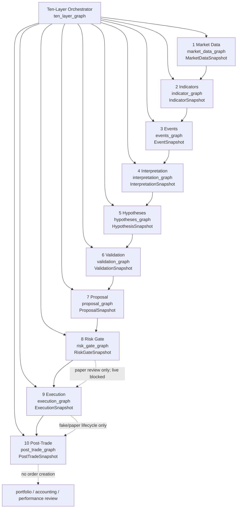
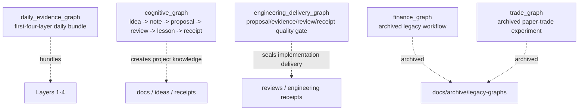

# Architecture: Ten-Layer LangGraph Map

Date: 2026-06-02
Status: current MVP map

## Summary

FinHarness now has a ten-layer evidence chain plus supporting governance
workflow graphs. The ten-layer chain is the primary domain path. Supporting
graphs are for daily bundling, cognitive engineering, and engineering delivery.
The older finance and trade graphs are archived historical references.

For the support governance graph positioning, see:

```text
docs/architecture/support-governance-graphs.md
```

## Primary Ten-Layer Chain



## Main Task Entrypoints

```text
task ten-layer:graph
task market-data:graph
task indicators:graph
task events:snapshot
task interpretation:graph
task hypotheses:graph
task validation:graph
task proposal:graph
task risk-gate:graph
task execution:graph
task post-trade:graph
```

## Orchestrator Run Policy

The top-level graph does not mean every trade must recompute all ten layers.
It means there is one authoritative route for deciding which layers are fresh,
which layers are reused, and which downstream gates must run.

```text
full research refresh:
  run layers 1-10

new evidence, same methods:
  rerun data/events/interpretation as needed, reuse validated methods

same research, new risk context:
  reuse layers 1-7, rerun layers 8-10

same approved paper decision, execution review:
  reuse layers 1-8, rerun layers 9-10

post-trade review only:
  reuse ExecutionSnapshot, rerun layer 10
```

Current implementation:

```text
src/finharness/ten_layer_graph.py
scripts/run_ten_layer_graph.py
task ten-layer:graph
```

The orchestrator supports `run_layers` plus supplied snapshots. A supplied
snapshot can be reused while only selected later layers run.

## Reuse Boundary

```text
Data can be cached, but freshness must be explicit.
Methods can be reused, but assumptions and versions must remain in lineage.
Signals can be reused only if their source evidence and validation context still apply.
Risk Gate should rerun whenever mandate, limits, liquidity, behavior, or human review changes.
Execution should rerun only when a permissioned paper action is being staged/submitted.
Post-Trade can run repeatedly from the same ExecutionSnapshot without creating orders.
```

## Math / Library / Exchange Boundary

The system should not choose between "top libraries/exchanges" and "math".
They serve different roles:

```text
Mathematics:
  definitions, invariants, statistical tests, slippage, risk, attribution,
  optimization, and falsification logic.

Mature libraries:
  reliable implementations of data handling, indicators, backtests, portfolio
  analytics, graph orchestration, and model evaluation.

Exchanges / brokers / venues / custodians:
  external source-of-truth systems for quotes, orders, fills, cancels,
  rejects, account state, and settlement/accounting evidence.
```

FinHarness should keep the mathematical contract inside its own typed evidence
layers, call mature libraries for specialized computation, and call exchanges or
brokers only through explicit adapter boundaries. The top-level graph records
which source owned each fact; it should not blur source truth, mathematical
interpretation, and operational authority.

## Research Asset Library

FinHarness now treats reusable strategy, method, and external-reference
knowledge as assets outside the ten-layer chain:

```text
StrategySpec:
  reusable strategy contract for L5-L10 handoff

MathMethodSpec:
  mathematical validation, risk, cost, robustness, or attribution contract

ReferenceCard:
  institutional standard, mature tool, provider, broker, or exchange boundary
```

Current implementation:

```text
src/finharness/research_assets.py
docs/research/
data/research/
tests/test_research_assets.py
tests/test_research_asset_handoff.py
```

The ten-layer graph may cite these assets, but the assets do not execute
strategies, compute portfolio accounting, claim compliance, or authorize
trading. The orchestrator now resolves asset ids through a cite-only
`research_assets` node and passes a compact `research_asset_context` to L5-L10
source configs.

CLI example:

```text
task ten-layer:graph -- \
  --asset-id strategy.trend_following.v0 \
  --asset-id math.validation.walk_forward.v0 \
  --asset-id reference.tool.vectorbt.v0
```

Layer handoff:

```text
L5 Hypotheses:
  records StrategySpec thesis/assumption references in source config

L6 Validation:
  records MathMethodSpec validation contracts in source config

L7 Proposal:
  records StrategySpec proposal/risk/execution constraint references

L8 Risk Gate:
  records StrategySpec risk contracts and MathMethodSpec risk methods

L9 Execution:
  records execution-boundary ReferenceCards and only reads approved constraints
  after Risk Gate, paper/fake-first

L10 Post-Trade:
  records review metric and attribution references
```

All asset contexts include:

```text
execution_allowed: false
policy: cite_only
missing_ids: [...]
```

## Supporting Graphs



## Graph Inventory

Primary layer graphs:

```text
src/finharness/ten_layer_graph.py
src/finharness/market_data_graph.py
src/finharness/indicator_graph.py
src/finharness/events_graph.py
src/finharness/interpretation_graph.py
src/finharness/hypotheses_graph.py
src/finharness/validation_graph.py
src/finharness/proposal_graph.py
src/finharness/risk_gate_graph.py
src/finharness/execution_graph.py
src/finharness/post_trade_graph.py
```

Active supporting graphs:

```text
src/finharness/daily_evidence_graph.py
src/finharness/cognitive_graph.py
src/finharness/engineering_delivery_graph.py
```

Research assets:

```text
src/finharness/research_assets.py
docs/research/
data/research/
```

Archived supporting graphs:

```text
docs/archive/legacy-graphs/finance_graph.py
docs/archive/legacy-graphs/trade_graph.py
```

Runner scripts:

```text
scripts/run_ten_layer_graph.py
scripts/run_market_data_graph.py
scripts/run_indicator_graph.py
scripts/run_events_snapshot.py
scripts/run_interpretation_graph.py
scripts/run_hypotheses_graph.py
scripts/run_validation_graph.py
scripts/run_proposal_graph.py
scripts/run_risk_gate_graph.py
scripts/run_execution_graph.py
scripts/run_post_trade_graph.py
scripts/run_daily_evidence_graph.py
scripts/run_cognitive_flow.py
scripts/run_engineering_delivery_graph.py
```

## Boundary Notes

```text
Layers 1-6 are evidence and research layers.
Layer 7 creates structured candidates, not orders.
Layer 8 is the independent pre-execution control gate.
Layer 9 records paper/fake-adapter execution lifecycle and keeps live blocked.
Layer 10 reconciles post-trade evidence and cannot create orders.
```

The project should treat the ten-layer Mermaid chart as the orienting map and
the individual module docs as the source of each layer's contract.
