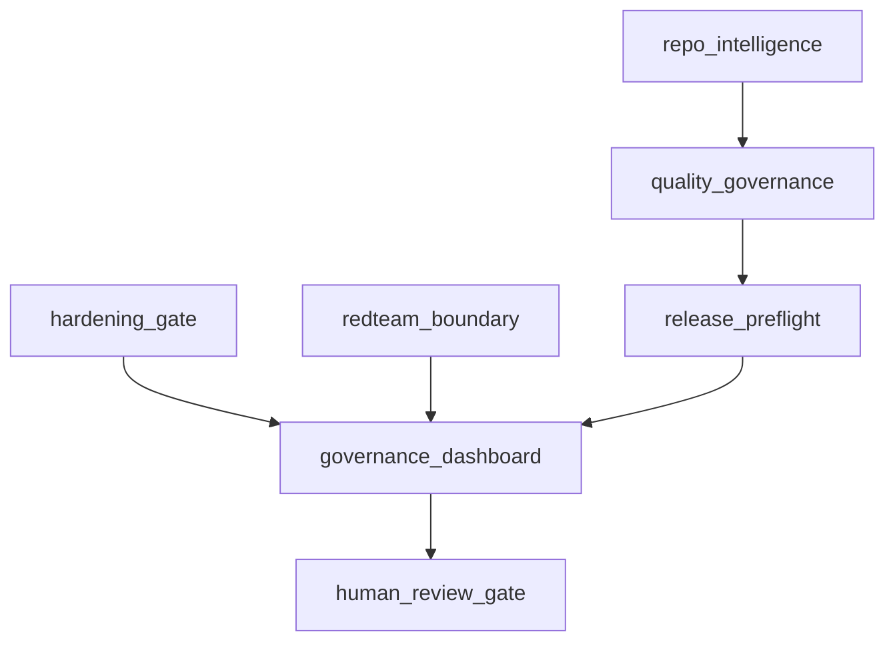

# Governance Dashboard

Generated at: `2026-06-10T09:15:26Z`

## RC0.1 Posture

- Release ready: `true`
- Release blocked: `false`
- Requires human review: `false`
- Execution allowed: `false`
- Dashboard status: `ready`

## Repo Intelligence

- Files: `354`
- Total lines: `70285`
- Changed files: `2`

## Required Checks

- `task check`
- `task hardening:gate`

## Quality Governance

- Decision: `passed`
- Release blocked: `false`
- Performance status: `within_budget`

## Hardening And Red Team

- Hardening gate: `passed`
- Red-team boundary: `passed`

## Mermaid

