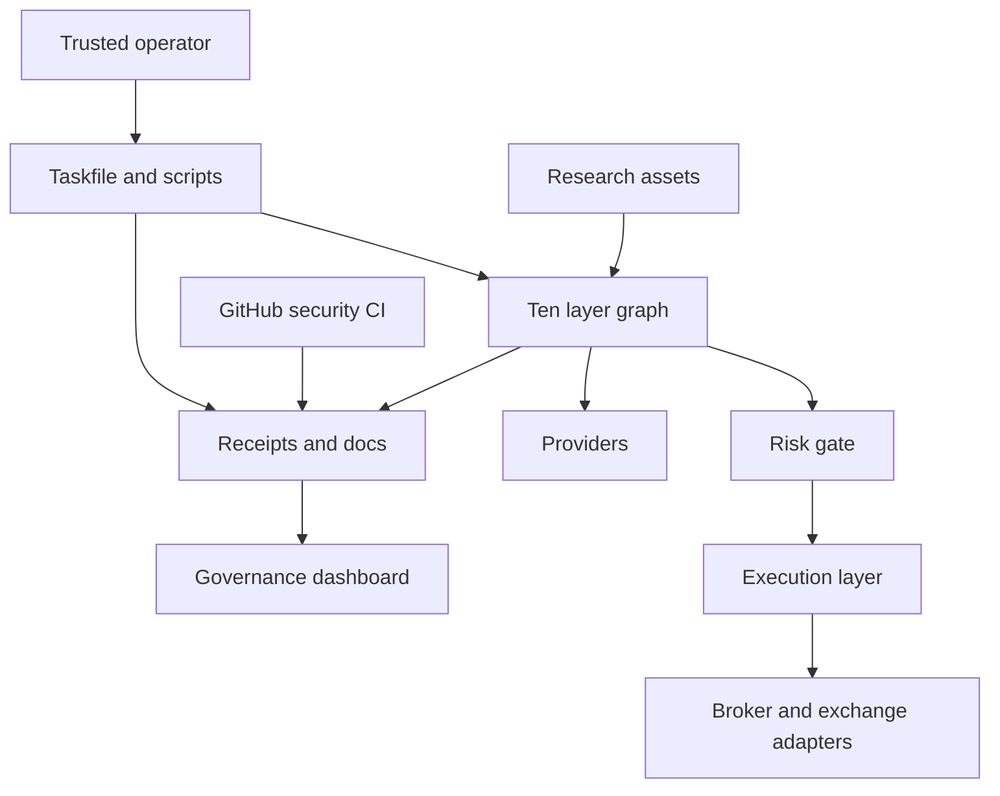

# FinHarness Threat Model

Date: 2026-06-04
Status: RC0.2 maturity baseline

## Executive summary

FinHarness is a local-first financial research and governance harness, not an
internet-facing trading service. The highest-risk themes are provider
credential exposure, accidental live mutation, research-asset or prompt
injection crossing into execution authority, receipt/log leakage, supply-chain
compromise, and false release claims. Current controls are strongest around
paper/fake-first execution, redacted scanner reporting, release preflight, and
GitHub security workflows; the largest residual gaps are formal fuzzing, SBOM
and provenance, and a fully PR-only review model for `main`.

## Scope and assumptions

In scope:

- Runtime/library code under `src/finharness/`.
- Operational scripts under `scripts/`.
- Task entrypoints in `Taskfile.yml`.
- Security workflows and scanner configuration under `.github/` and
  `.gitleaks.toml`.
- Research assets under `data/research/`.
- Governance docs and receipts that support release claims.

Out of scope:

- External broker, exchange, provider, or LLM service internals.
- Correctness of live brokerage, settlement, tax, or portfolio accounting.
- Autonomous live trading approval; this remains explicitly out of scope.
- Secrets themselves. This model must not read or reproduce secret material.

Assumptions:

- Primary users are local maintainers or trusted operators running CLI/tasks.
- The repository is public, but secrets are expected to stay in ignored local
  environment files or external provider configuration.
- GitHub Actions is the authoritative remote CI surface for RC0.1/RC0.2.
- Alpaca paths are paper-first, OKX live write paths are exceptional and gated,
  and the ten-layer graph does not authorize live trading.
- Receipts can contain sensitive operational metadata even when they should not
  contain raw secrets.

Open questions that would materially change risk:

- Will FinHarness become a hosted multi-user service?
- Will live-read or live-write provider credentials be used by more than one
  human/operator?
- Will release artifacts be distributed as packages, containers, or binaries?

## System model

### Primary components

- Ten-layer domain orchestrator: `src/finharness/ten_layer_graph.py` coordinates
  L1-L10 and supports reuse of supplied snapshots.
- Evidence layers: `market_data_graph`, `indicator_graph`, `events_graph`,
  `interpretation_graph`, `hypotheses_graph`, `validation_graph`,
  `proposal_graph`, `risk_gate_graph`, `execution_graph`, and
  `post_trade_graph`.
- Research asset library: `src/finharness/research_assets.py` loads
  StrategySpec, MathMethodSpec, and ReferenceCard JSON assets as cite-only
  context.
- Execution and risk gates: `src/finharness/risk_gate.py` and
  `src/finharness/execution.py` enforce paper-review and live-blocking
  boundaries.
- Provider adapters/scripts: `src/finharness/alpaca_client.py`,
  `src/finharness/okx_cli.py`, and provider-facing scripts in `scripts/`.
- Governance graphs: `repo_intelligence_graph`, `quality_governance_graph`,
  `release_preflight_graph`, `governance_dashboard_graph`, and
  `engineering_delivery_graph`.
- CI/security tooling: `.github/workflows/security.yml`,
  `.github/workflows/scorecard.yml`, `.github/dependabot.yml`, and
  `.gitleaks.toml`.

### Data flows and trust boundaries

- Operator -> Taskfile/CLI:
  - Data: command arguments, selected symbols, run modes, local flags.
  - Channel: shell command invocation.
  - Guarantees: local operator trust assumption; no remote authentication.
  - Validation: argparse/task entrypoint validation, explicit `--execute`,
    `--live`, and provider-specific gates.

- Taskfile/CLI -> FinHarness layer code:
  - Data: symbols, dates, research asset IDs, risk/execution context.
  - Channel: in-process Python/Rust calls.
  - Guarantees: typed Pydantic models in layer contracts.
  - Validation: model validation and layer-specific quality checks.

- FinHarness -> external data providers:
  - Data: market symbols, provider queries, public market responses.
  - Channel: HTTPS or external CLI calls.
  - Guarantees: provider TLS and provider authentication where applicable.
  - Validation: response shape checks and normalized snapshots.

- FinHarness -> broker/exchange paper/live surfaces:
  - Data: account state, paper orders, OKX read/write commands.
  - Channel: HTTPS for Alpaca paper; `okx` subprocess for OKX CLI.
  - Guarantees: credentials are loaded from environment/local ignored files.
  - Validation: paper-first client design, OKX read/write allowlists, explicit
    mutation gate, and `FINHARNESS_OKX_ENABLE_LIVE_MUTATIONS=1` for live
    mutation.

- Research assets -> L5-L10:
  - Data: strategy/method/reference JSON specs and asset IDs.
  - Channel: local file reads.
  - Guarantees: cite-only policy and compact layer contexts.
  - Validation: unknown IDs remain missing-only; compact contexts do not expose
    prompt text or execution constraints as authority.

- FinHarness -> receipts/reports:
  - Data: snapshots, lineage, quality decisions, scanner summaries.
  - Channel: local JSON/Markdown writes under `data/receipts/` and `docs/`.
  - Guarantees: release gates record `execution_allowed=false`; hardening
    summaries redact scanner secret values.
  - Validation: hardening tests and release preflight checks.

- GitHub Actions -> repository security evidence:
  - Data: source checkout, dependency manifests, scanner outputs, SARIF.
  - Channel: GitHub-hosted runners and GitHub code scanning APIs.
  - Guarantees: pinned GitHub actions and job-level token permissions.
  - Validation: CodeQL, Gitleaks, Trivy, Scorecard, Dependabot, and rulesets.

#### Diagram

## Assets and security objectives

| Asset | Why it matters | Security objective (C/I/A) |
| --- | --- | --- |
| Provider credentials | Can expose accounts or enable unauthorized provider actions | C/I |
| Live mutation gates | Prevent accidental or malicious live orders | I |
| Research asset specs | Can inject misleading assumptions into L5-L10 | I |
| Risk and execution receipts | Prove lineage and release boundaries | I/C |
| Scanner reports | May contain secret-like material if mishandled | C/I |
| GitHub workflows and rulesets | Control release quality and supply-chain posture | I/A |
| Dependency lockfiles | Determine executed third-party code | I/A |
| Paper/live boundary docs | Prevent overclaiming and unsafe operation | I |

## Attacker model

### Capabilities

- Can read the public repository and craft pull requests, malicious asset IDs,
  or misleading research asset JSON.
- Can attempt prompt injection through research/reference text.
- Can attempt to commit secrets, alter workflows, weaken gates, or poison
  receipts.
- Can exploit vulnerable dependencies or unpinned build actions if governance
  drifts.
- If they gain local operator access, can run local tasks and attempt to pass
  unsafe provider arguments.

### Non-capabilities

- Cannot directly reach a FinHarness network service because no server is in
  scope.
- Cannot bypass provider-side authentication without credentials.
- Cannot treat green FinHarness receipts as live trading approval.
- Cannot make L9 live execution valid without changing code/config and passing
  review gates.

## Entry points and attack surfaces

| Surface | How reached | Trust boundary | Notes | Evidence |
| --- | --- | --- | --- | --- |
| Task entrypoints | `task ...` | Operator shell -> local workflow | Primary control surface | `Taskfile.yml` |
| Ten-layer graph | `task ten-layer:graph` | Operator input -> graph state | Coordinates reuse and layer selection | `src/finharness/ten_layer_graph.py` |
| Research asset loader | JSON files/asset IDs | Local files -> L5-L10 context | Cite-only boundary must hold | `src/finharness/research_assets.py` |
| Risk gate | L7 proposal -> L8 decision | Proposal evidence -> permission decision | Blocks order language and live authority | `src/finharness/risk_gate.py` |
| Execution graph | L8 risk snapshot -> L9 lifecycle | Permission decision -> order-shaped request | Live mode blocked in MVP | `src/finharness/execution.py` |
| OKX adapter | `task okx:*` | CLI args/env -> external CLI | Read/write allowlists and live mutation env gate | `src/finharness/okx_cli.py` |
| Alpaca paper client | paper scripts | Env credentials -> HTTPS API | Paper-first; not live adapter | `src/finharness/alpaca_client.py` |
| Receipts and reports | local JSON/Markdown writes | Runtime evidence -> durable files | Must not leak raw secrets or overclaim | `src/finharness/hardening.py` |
| Security CI | push/PR/workflow dispatch | GitHub runner -> code scanning | Pinned actions and job permissions | `.github/workflows/security.yml` |
| Release preflight | `task release:preflight` | local checks -> release gate | Seals release evidence, not trading authority | `src/finharness/release_preflight_graph.py` |

## Top abuse paths

1. Credential leakage -> attacker commits or prints local secrets -> scanner or
   receipt captures raw secret -> public CI/log/doc leaks provider access.
2. Live mutation bypass -> attacker weakens OKX allowlist/env gate -> live
   write task accepts mutating command -> real account state changes.
3. Asset injection -> malicious StrategySpec says to authorize live trading ->
   compact context preserves prompt text as instruction -> downstream layer
   treats it as authority.
4. Release-gate downgrade -> attacker modifies workflow or Taskfile checks ->
   preflight passes weak checks -> unsafe release claim is made.
5. Dependency compromise -> malicious dependency/action executes in CI or local
   task -> secrets or receipts are exfiltrated or build evidence is poisoned.
6. Receipt poisoning -> malformed generated receipt claims `execution_allowed`
   or hides failed checks -> dashboard reports false readiness.
7. Provider response confusion -> untrusted provider/CLI response shape is
   interpreted as valid evidence -> wrong market/account state feeds decisions.
8. Review bypass -> main admin bypass remains convenient -> high-risk config
   change lands without PR review -> Scorecard/CI catches late or not at all.

## Threat model table

| Threat ID | Threat source | Prerequisites | Threat action | Impact | Impacted assets | Existing controls (evidence) | Gaps | Recommended mitigations | Detection ideas | Likelihood | Impact severity | Priority |
| --- | --- | --- | --- | --- | --- | --- | --- | --- | --- | --- | --- | --- |
| TM-001 | Local operator, PR author, compromised dependency | Secret enters repo, log, or receipt path. | Exfiltrate provider/API credentials through committed files or generated outputs. | Unauthorized provider access or public leak. | Provider credentials, scanner reports | Gitleaks and redacted classifier in `src/finharness/hardening.py`; security workflow in `.github/workflows/security.yml`; security policy in `.github/SECURITY.md` | No full secret inventory or rotation runbook | Add secret handling runbook, rotation checklist, and optional pre-commit secret scan | Alert on Gitleaks findings, unexpected `.env*` files, receipt diffs containing credential-like keys | medium | high | high |
| TM-002 | Local operator or malicious code change | OKX live credentials configured and mutation gates weakened. | Run live mutating OKX action or bypass allowlist. | Real account/order/account-setting mutation. | Live mutation gates, provider credentials | `run_okx_command` allowlists and `FINHARNESS_OKX_ENABLE_LIVE_MUTATIONS` gate in `src/finharness/okx_cli.py`; tests in `tests/test_okx_cli.py` | No dual-control approval for live writes | Keep live-write outside ten-layer graph, add signed/manual approval receipt before any live mutation task | Audit invocations of `task okx:live-write`, env gate use, and ruleset changes touching OKX code | low | high | high |
| TM-003 | Prompt/asset injection attacker | Malicious asset JSON or asset ID is selected. | Convert research/reference text into execution authority. | Unauthorized or misleading L5-L10 behavior. | Research asset specs, live boundary docs | Cite-only selection and compact context in `src/finharness/research_assets.py`; tests in `tests/test_hardening_gate.py` | No schema signature or provenance for asset library | Add asset provenance fields and checksum receipts; expand corpus with malformed JSON and oversized assets | Track missing IDs, asset changes, and unexpected `execution_allowed` claims in receipts | medium | high | high |
| TM-004 | Developer or PR author | Workflow/Taskfile/preflight changed. | Weaken checks while keeping release-ready language. | False release confidence and missed vulnerabilities. | GitHub workflows, release receipts | `task release:preflight`; `release_preflight_graph`; rulesets in `docs/operations/repository-governance.md`; CodeQL/Gitleaks/Trivy workflow | Main keeps admin bypass; no CODEOWNERS | Add CODEOWNERS and require PR-only for high-risk paths when team workflow is ready | Alert on changes under `.github/`, `Taskfile.yml`, `src/finharness/*execution*`, `risk_gate`, `hardening` | medium | high | high |
| TM-005 | Dependency or action supply-chain attacker | Malicious or vulnerable dependency enters lockfile or workflow. | Execute attacker-controlled code in CI/local checks. | Code execution, evidence poisoning, data exfiltration. | Dependencies, workflows, release evidence | Dependabot config, SHA-pinned actions, Trivy, `uv.lock`, `pnpm-lock.yaml`, `.github/workflows/security.yml` | No SBOM/provenance baseline yet | Add SBOM task and SLSA provenance plan before packaging artifacts | Monitor Dependabot, lockfile diffs, Scorecard Pinned-Dependencies, Trivy findings | medium | high | high |
| TM-006 | Local operator or malformed provider response | Provider API/CLI returns unexpected or stale data. | Treat bad quote/order/account data as valid evidence. | Bad research conclusions or unsafe paper workflow. | Market/account evidence, receipts | Response shape checks in `src/finharness/alpaca_client.py` callers and layer quality fields | Freshness and provider outage monitoring are incomplete | Add freshness monitor and provider outage playbook; enforce stale-data status in receipts | Dashboard stale receipt warnings, provider error counters, data age fields | medium | medium | medium |
| TM-007 | Developer, local process, or malicious generated data | Receipt writer or generated file claims readiness incorrectly. | Poison dashboard or release gate evidence. | Incorrect governance state. | Receipts, dashboard, release preflight | `governance_dashboard_graph`, `release_preflight_graph`, property tests in `tests/test_property_baseline.py` | Receipts are unsigned and mutable local files | Add receipt schema/version checksums and optional signed release receipts | Diff generated receipts; assert `execution_allowed=false` invariants in tests | medium | medium | medium |
| TM-008 | External contributor or compromised admin | Main admin bypass used for sensitive change. | Land high-risk change without prior review. | Review gap for security-critical paths. | Rulesets, workflows, trading boundaries | `main` ruleset requires checks and allows admin bypass; `release/*` strict ruleset | Main is not PR-only and lacks CODEOWNERS | Add CODEOWNERS; require PR for release branches now and consider PR-only main later | Scorecard Code-Review and Branch-Protection alerts; ruleset audit logs | medium | medium | medium |

## Criticality calibration

- Critical: credible path to unauthorized live order placement, raw credential
  disclosure from project source, or CI compromise that can write trusted
  release artifacts.
- High: weakening of live gates, scanner/preflight bypass, or asset injection
  that can influence L8/L9 authority boundaries.
- Medium: stale or malformed evidence causing wrong research conclusions,
  dashboard false readiness that still requires local/operator preconditions,
  or review bypass without direct provider impact.
- Low: documentation drift, low-sensitivity metadata leaks, or issues requiring
  unrealistic attacker control in a local-only workflow.

## Focus paths for security review

| Path | Why it matters | Related Threat IDs |
| --- | --- | --- |
| `src/finharness/okx_cli.py` | Live read/write allowlists and mutation gates | TM-002 |
| `src/finharness/alpaca_client.py` | Paper credentials and provider request boundary | TM-001, TM-006 |
| `scripts/alpaca_paper_strategy_order.py` | Paper order lifecycle and receipt generation | TM-001, TM-006 |
| `src/finharness/execution.py` | L9 live-blocking and order lifecycle evidence | TM-002, TM-003 |
| `src/finharness/risk_gate.py` | L8 permission and mandate boundary | TM-002, TM-003 |
| `src/finharness/research_assets.py` | Asset cite-only loading and compact context | TM-003 |
| `src/finharness/hardening.py` | Redacted scanner summaries and boundary corpus | TM-001 |
| `src/finharness/release_preflight_graph.py` | Release readiness gate | TM-004, TM-007 |
| `src/finharness/governance_dashboard.py` | Aggregated governance posture | TM-007 |
| `.github/workflows/security.yml` | Remote security checks and token permissions | TM-004, TM-005 |
| `.github/workflows/scorecard.yml` | OpenSSF signal and SARIF upload | TM-004, TM-005 |
| `.gitleaks.toml` | Secret-finding policy | TM-001 |
| `Taskfile.yml` | Canonical operator entrypoints | TM-002, TM-004 |
| `data/research/` | Strategy/method/reference asset inputs | TM-003 |

## Quality check

- Entry points covered: Taskfile, scripts, ten-layer graph, provider adapters,
  research assets, receipts, GitHub workflows.
- Trust boundaries covered in threats: operator input, provider credentials,
  external data, asset JSON, receipts, CI/supply chain.
- Runtime vs CI/dev separated: runtime layers and provider adapters are modeled
  separately from GitHub workflows and release gates.
- User clarifications: not collected interactively for v1; assumptions are
  listed explicitly because the requested path was to proceed.
- Open questions are documented and should be revisited if FinHarness becomes a
  hosted service or live trading system.

