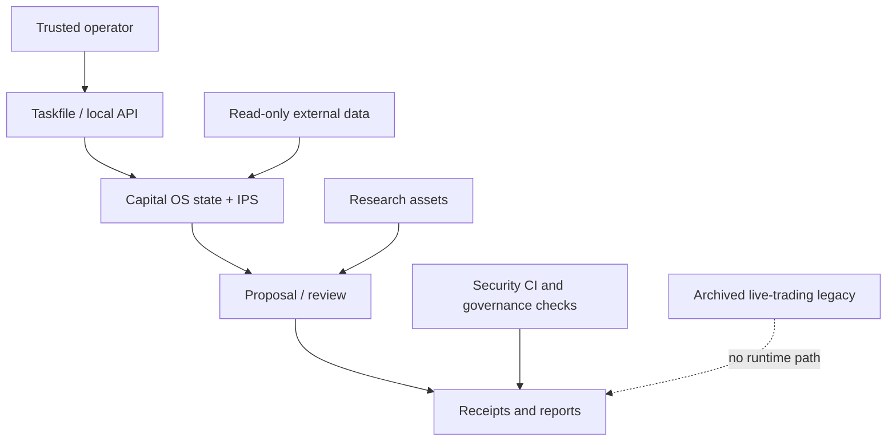

# FinHarness Threat Model

Date: 2026-06-28
Status: current mainline baseline

## Executive Summary

FinHarness is a local-first personal capital governance harness, not an
internet-facing trading service. The current mainline is Capital OS: personal
capital state, IPS, proposal/review, evidence, Agent explanation, and cockpit
read surfaces. Live-trading experiments are archived under
`experiments/archive/live_trading_legacy/` and are not a runtime authority path.

The highest-risk themes are Provider credentials, accidental reintroduction of
archived live-trading authority, research-asset or prompt injection crossing
into proposal authority, receipt/log leakage, supply-chain compromise, and false
release claims. Current controls are strongest around explicit
`execution_allowed=false` invariants, governance policy checks, redacted scanner
reporting, release preflight, and GitHub security workflows.

## Scope And Assumptions

In scope:

- Runtime/library code under `src/finharness/`.
- Operational scripts under `scripts/`.
- Task entrypoints in `Taskfile.yml`.
- Security workflows and scanner configuration under `.github/` and
  `.gitleaks.toml`.
- Research assets under `data/research/`.
- Security evidence under `docs/security/` and `data/security/`.
- Governance docs and receipts that support release claims.
- The archived live-trading boundary at `experiments/archive/live_trading_legacy/`.

Out of scope:

- External broker, exchange, provider, or LLM service internals.
- Correctness of live brokerage, settlement, tax, or portfolio accounting.
- Autonomous live trading approval; this remains explicitly out of scope.
- Secrets themselves. This model must not read or reproduce secret material.

Assumptions:

- Primary users are local maintainers or trusted operators running CLI/tasks.
- Secrets stay in ignored local environment files or external provider
  configuration.
- GitHub Actions is the authoritative remote CI surface.
- Mainline external data access is read-only evidence input; it does not create
  order authority.
- The Archived live-trading boundary does not authorize live trading and must
  stay disconnected from Taskfile tasks, API routes, Agent tools, and CI safety
  gates.
- Receipts can contain sensitive operational metadata even when they should not
  contain raw secrets.

Open questions that would materially change risk:

- Will FinHarness become a hosted multi-user service?
- Will live-read or live-write provider credentials be used by more than one
  human/operator?
- Will release artifacts be distributed as packages, containers, or binaries?

## System Model

### Primary Components

- Capital OS domain: `statecore/`, `allocation.py`, `exposure.py`,
  `personal_finance.py`, and `beancount_adapter.py`.
- IPS and decision policy: `src/finharness/ips.py`,
  `src/finharness/api/routes_ips.py`, `statecore/decision_scaffold.py`, and
  `statecore/risk_classification.py`.
- Proposal/review records: `statecore/proposals.py`, `review_read.py`,
  `api/routes_proposals.py`, and `api/routes_review.py`.
- Research asset library: `src/finharness/research_assets.py` loads
  StrategySpec, MathMethodSpec, and ReferenceCard JSON assets as cite-only
  context.
- External data inputs: `src/finharness/data_entry.py`,
  `src/finharness/market_data.py`, and `src/finharness/providers/ccxt_provider.py`
  provide read-only provider data.
- Authorization and restricted-symbol records:
  `src/finharness/authorization.py` and `src/finharness/restricted_symbols.py`.
- Governance graphs: `repo_intelligence_graph`, `quality_governance_graph`,
  `release_preflight_graph`, `governance_dashboard_graph`, and
  `engineering_delivery_graph`.
- Security tooling: `.github/workflows/security.yml`,
  `.github/workflows/scorecard.yml`, `.github/dependabot.yml`, `.gitleaks.toml`,
  `.github/CODEOWNERS`, and `docs/security/security-response-runbook.md`.
- Archived live-trading experiments:
  `experiments/archive/live_trading_legacy/` contains old OKX, Alpaca, trading
  guard, and market-access code retained only as historical reference.

### Data Flows And Trust Boundaries

- Operator -> Taskfile/API:
  - Data: command arguments, selected symbols, local flags, HTTP payloads.
  - Channel: shell command invocation or local FastAPI route.
  - Validation: argparse/task validation, Pydantic models, StateCore checks.

- Taskfile/API -> Capital OS:
  - Data: proposals, review events, IPS inputs, snapshots, evidence attachments.
  - Channel: in-process Python calls.
  - Validation: governed proposal constructors, database constraints, and
    `execution_allowed=false` guards.

- Capital OS -> external data providers:
  - Data: market symbols, provider queries, public market responses.
  - Channel: HTTPS/provider libraries.
  - Validation: response shape checks, normalized snapshots, quality reports.

- Research assets -> proposal/review/Agent context:
  - Data: strategy/method/reference JSON specs and selected asset IDs.
  - Channel: local file reads.
  - Validation: cite-only policy; unknown IDs remain missing-only; compact
    contexts do not grant execution authority.

- FinHarness -> receipts/reports:
  - Data: snapshots, lineage, quality decisions, scanner summaries.
  - Channel: local JSON/Markdown writes under `data/receipts/` and `docs/`.
  - Validation: hardening tests, release preflight checks, and redacted scanner
    summaries.

- Archived live-trading code:
  - Data: historical OKX/Alpaca/trading-guard examples.
  - Channel: no mainline import/Taskfile/API channel.
  - Validation: current docs and policy checks must keep it outside runtime
    authority.

## Assets And Security Objectives

| Asset | Why it matters | Security objective |
| --- | --- | --- |
| Provider credentials | Can expose accounts or provider quotas | Confidentiality, integrity |
| Archived live-trading boundary | Prevents old execution code from becoming authority | Integrity |
| Research asset specs | Can inject misleading assumptions into proposal context | Integrity |
| Proposal/review receipts | Prove lineage and non-execution boundaries | Integrity, confidentiality |
| Scanner reports | May contain secret-like material if mishandled | Confidentiality, integrity |
| GitHub workflows and rulesets | Control release quality and supply-chain posture | Integrity, availability |
| Dependency lockfiles | Determine executed third-party code | Integrity, availability |
| Security docs and CODEOWNERS | Prevent overclaiming and stale ownership | Integrity |

## Attacker Model

Capabilities:

- Can read the public repository and craft pull requests, malicious asset IDs, or
  misleading research asset JSON.
- Can attempt prompt injection through research/reference text.
- Can attempt to commit secrets, alter workflows, weaken gates, or poison
  receipts.
- Can exploit vulnerable dependencies or unpinned build actions if governance
  drifts.
- If they gain local operator access, can run local tasks and try to pass unsafe
  provider arguments.

Non-capabilities:

- Cannot directly reach a FinHarness network service because no hosted service
  is in scope.
- Cannot bypass provider-side authentication without credentials.
- Cannot treat green FinHarness receipts as live trading approval.
- Cannot make archived live-trading code authoritative without changing code,
  Taskfile/API exposure, and review gates.

## Entry Points And Attack Surfaces

| Surface | How reached | Trust boundary | Notes | Evidence |
| --- | --- | --- | --- | --- |
| Task entrypoints | `task ...` | Operator shell -> local workflow | Primary control surface | `Taskfile.yml` |
| Cockpit/API | local FastAPI routes | HTTP payload -> adapters | Thin adapter over read/command surfaces | `src/finharness/api/` |
| Proposal/review writes | governed constructors | user intent -> durable record | Must keep `execution_allowed=false` | `statecore/proposals.py` |
| Research asset loader | JSON files/asset IDs | local files -> cite-only context | Cannot become instructions | `src/finharness/research_assets.py` |
| External data inputs | yfinance/OpenBB/ccxt | provider response -> local evidence | Read-only data; no order authority | `src/finharness/data_entry.py`, `providers/` |
| Restricted symbols | local security list | data/security -> risk signal | Fail closed when list is unreadable | `src/finharness/restricted_symbols.py` |
| Archived live-trading code | archived files only | history -> no runtime authority | No Taskfile/API/Agent path | `experiments/archive/live_trading_legacy/` |
| Receipts and reports | local JSON/Markdown writes | runtime evidence -> durable files | Must not leak raw secrets or overclaim | `src/finharness/hardening.py` |
| Security CI | push/PR/workflow dispatch | GitHub runner -> code scanning | Pinned actions and job permissions | `.github/workflows/security.yml` |
| Release preflight | `task release:preflight` | local checks -> release gate | Seals release evidence, not trading authority | `src/finharness/release_preflight_graph.py` |

## Top Abuse Paths

1. Credential leakage -> committed or generated secret-like material reaches
   public logs, docs, or receipts.
2. Archived live-trading boundary erosion -> old OKX/Alpaca/trading code is
   reconnected to Taskfile/API/Agent tools and mistaken for current authority.
3. Research asset injection -> malicious JSON or asset ID tries to convert
   cite-only context into instructions.
4. Release-gate downgrade -> workflows or Taskfile checks are weakened while
   release-ready language remains.
5. Dependency compromise -> malicious dependency/action executes in CI or local
   checks and poisons evidence.
6. Receipt poisoning -> generated evidence claims `execution_allowed=true` or
   hides failed checks.
7. Provider response confusion -> malformed/stale provider data feeds capital
   state without clear quality signals.
8. Review bypass -> high-risk config or governance changes land without human
   review.

## Threat Model Table

| ID | Threat source | Action | Impacted assets | Existing controls | Gaps | Detection ideas | Priority |
| --- | --- | --- | --- | --- | --- | --- | --- |
| TM-001 | Local operator, PR author, compromised dependency | Exfiltrate provider credentials through committed files or generated outputs. | Provider credentials, scanner reports | Gitleaks/redacted classifier in `src/finharness/hardening.py`; security workflow; response runbook | No full secret inventory or automated rotation proof | Gitleaks findings, unexpected `.env*` files, receipt diffs | high |
| TM-002 | Developer or malicious PR | Reconnect archived live-trading code to current Taskfile/API/Agent path. | Archived live-trading boundary, Provider credentials | Archive in `experiments/archive/live_trading_legacy/`; `GOV-DOCS-*` current-doc checks; CODEOWNERS | No formal dual-control process for any future live-write redesign | Changes touching archive, Taskfile, API, Agent tools, provider code | high |
| TM-003 | Prompt/asset injection attacker | Convert research/reference text into proposal or execution authority. | Research asset specs, proposal/review receipts | Cite-only research asset selection; redline tests; `execution_allowed=false` | No signed asset provenance | Missing IDs, asset diffs, unexpected execution claims | high |
| TM-004 | Developer or PR author | Weaken checks while preserving release-ready wording. | GitHub workflows, release receipts | `task release:preflight`; policy registry; CodeQL/Gitleaks/Trivy | Main keeps admin bypass; code-owner review not required by ruleset | Workflow/Taskfile diffs, ruleset audit logs | high |
| TM-005 | Dependency or action supply-chain attacker | Execute attacker-controlled code in CI/local checks. | Dependencies, workflows, release evidence | Dependabot, SHA-pinned actions, Trivy, lockfiles | No signed SLSA provenance yet | Dependabot, Scorecard, Trivy, lockfile diffs | high |
| TM-006 | Provider or malformed response | Treat bad quote/provider data as valid evidence. | External data, capital state, receipts | `data_entry.py`, `market_data.py`, provider quality checks | Freshness/provider outage monitoring incomplete | Quality reports, stale-data notes, provider errors | medium |
| TM-007 | Local process or generated data | Poison receipts or dashboard with false readiness. | Receipts, dashboard, release preflight | `governance_dashboard_graph`, `release_preflight_graph`, property tests | Receipts are unsigned local files | Receipt schema checks, diff review, dashboard status | medium |
| TM-008 | External contributor or compromised admin | Land high-risk change without prior review. | Rulesets, workflows, security docs, boundaries | `.github/CODEOWNERS`; governance docs; branch rulesets | Main is not PR-only and code-owner review is not enforced by ruleset | Scorecard Code-Review/Branch-Protection, ruleset audit logs | medium |

## Focus Paths For Security Review

| Path | Why it matters | Related threats |
| --- | --- | --- |
| `src/finharness/authorization.py` | Operator/account authorization records | TM-002, TM-008 |
| `src/finharness/restricted_symbols.py` | Restricted-symbol and tradability fail-closed boundary | TM-002, TM-006 |
| `src/finharness/research_assets.py` | Asset cite-only loading and compact context | TM-003 |
| `src/finharness/data_entry.py` | Read-only external data input | TM-006 |
| `src/finharness/providers/ccxt_provider.py` | Optional provider boundary and dependency loading | TM-006 |
| `src/finharness/hardening.py` | Redacted scanner summaries and boundary corpus | TM-001 |
| `src/finharness/release_preflight_graph.py` | Release readiness gate | TM-004, TM-007 |
| `src/finharness/governance_dashboard.py` | Aggregated governance posture | TM-007 |
| `experiments/archive/live_trading_legacy/` | Historical live-trading code; must stay non-mainline | TM-002 |
| `.github/workflows/security.yml` | Remote security checks and token permissions | TM-004, TM-005 |
| `.github/workflows/scorecard.yml` | OpenSSF signal and SARIF upload | TM-004, TM-005 |
| `.gitleaks.toml` | Secret-finding policy | TM-001 |
| `.github/CODEOWNERS` | Review ownership map for high-risk paths | TM-008 |
| `Taskfile.yml` | Canonical operator entrypoints | TM-002, TM-004 |
| `data/research/` | Strategy/method/reference asset inputs | TM-003 |
| `data/security/` | Security policy inputs and fuzz corpus | TM-002, TM-006 |

## Paper Validation Legacy Isolation Boundary

Status: closed (SEC-BOUNDARY-02)
Debt: ENG-DEBT-0002 (resolved)
Last reviewed: 2026-07-10
Closed by: SEC-02A (#235), SEC-02B (#236), SEC-02C (#237), SEC-02D (#238)

### Scope

The PaperValidation surface comprises four legacy StateCore models with
associated API routes, domain modules, and receipt-backed writes:

| Component | Type | Location |
| --- | --- | --- |
| `PaperAccount` | SQLModel table | `statecore/models.py` |
| `PaperOrderTicketCandidate` | SQLModel table | `statecore/models.py` |
| `PaperExecutionReceipt` | SQLModel table | `statecore/models.py` |
| `PaperPosition` | SQLModel table | `statecore/models.py` |
| Paper validation routes (6 endpoints) | FastAPI router | `api/routes_paper_validation.py` |
| `paper_accounts.py` | Domain module | `statecore/paper_accounts.py` |
| `paper_order_tickets.py` | Domain module | `statecore/paper_order_tickets.py` |
| `paper_executions.py` | Domain module | `statecore/paper_executions.py` |

### Threat Model

**TM-PV-001: Live execution graduation through legacy surface.**

A future contributor could add a `broker_order_id`, `venue`, or `execution_allowed`
field to a paper model, create a broker-adapter path through the paper routes, or
wire the paper ticket/execution flow into the Execution Kernel's
submit_order/SimulatedBrokerAdapter path.

Existing controls:
- All four models have CHECK constraints (`live_execution_allowed = 0`,
  `real_cash_at_risk = 0`, `submitted_to_broker = 0`, `authority_transition = 0`)
  and Pydantic field validators that reject `True` for these fields.
- The `_live_or_submit_marker()` function scans ticket and execution input dicts
  for prohibited keys (`broker_order_id`, `execution_allowed`, `live`, `venue`,
  `fix_tags`, etc.) and rejects at the domain boundary.
- All API response models hardcode `live_execution_allowed: False`,
  `real_cash_at_risk: False`, `submitted_to_broker: False`.
- The router is `deprecated=True` with `tags=["paper-validation", "legacy"]` and
  emits `X-FinHarness-Legacy-Surface` headers.
- All write endpoints require `WriteCapabilityDependency`.
- The legacy bridge classifies `PaperOrderTicketCandidate` and
  `PaperExecutionReceipt` as deletion candidates, projected into canonical
  Execution Kernel objects.

Gaps: resolved by SEC-02C — broker registry runtime isolation test
(`test_paper_validation_broker_registry_isolation.py`) proves zero
register/resolve/submit calls across the full paper API golden path.

**TM-PV-002: Second execution system through legacy extension.**

A contributor could extend the paper ticket/execution chain with new fields
(real account credentials, broker routing, FIX tag support) and treat the paper
surface as a scaffold for a hidden second broker integration path.

Existing controls: the canonical Execution Kernel (`/execution/*` routes,
`execution/services.py`, `execution/broker.py`) is documented as the only
execution path. The roadmap explicitly prohibits new paper-validation features
and the debt register lists this as non-goal.

Gaps: resolved by SEC-02B and the 2026-07-11 audit correction — the AST import
graph uses canonical importable module names, includes package initialization and
external leaf imports, fails on missing boundary roots, and detects direct,
relative, and multi-hop forbidden imports. Dependency-free project paths prevent
paper modules from importing network-capable market-data wheels merely to locate
artifact roots.

**TM-PV-003: Silent consumer bypass.**

A developer could route a new cockpit tab, Agent tool, or automation directly to
paper endpoints without realizing they are deprecated and structurally different
from the canonical execution pipeline.

Existing controls: the `deprecated=True` tag and legacy headers inform callers;
the legacy bridge separates paper projections from execution facts.

Gaps: resolved by SEC-02A — machine-verifiable consumer manifest
(`docs/governance/paper-validation-consumers.json` + `paper_validation_boundary_audit.py`
+ `test_paper_validation_consumer_manifest.py`). The AST scanner detects
unregistered consumers and the contract test validates manifest completeness.

### Isolation Rules (contract, not convention)

1. PaperValidation models must never add `broker_order_id`, `venue`,
   `fix_tags`, `credential_ref`, `broker_connection_id`, or any field that
   implies live brokerage.
2. PaperValidation routes must never import from `finharness.execution.broker`
   or `finharness.execution.adapters`.
3. PaperValidation routes must never call `submit_order`, `register_broker_adapter`,
   or any Execution Kernel command.
4. PaperValidation domain modules must never import `BrokerConnection`,
   `ExecutionAccount`, `ExecutionOrder`, or `SimulatedBrokerAdapter`.
5. Every paper model CHECK constraint `live_execution_allowed = 0` must remain
   in place and verified by a database-level test.
6. Every paper API response `live_execution_allowed: False` must remain hardcoded
   and verified by an HTTP-level test.
7. The paper ticket validator `_live_or_submit_marker` must continue to reject
   live/broker-submit keys and be verified by a unit test.

### Consumer Audit

Direct consumers of the PaperValidation surface (`2026-07-10`):

| Consumer | Type | Location | Migration path |
| --- | --- | --- | --- |
| `routes_paper_validation.py` | API router | `api/routes_paper_validation.py` | Delete when no callers remain. |
| `api/app.py` | Router registration | `api/app.py:142` | Remove `include_router` line. |
| `paper_accounts.py` | Domain module | `statecore/paper_accounts.py` | Archeology-only. |
| `paper_order_tickets.py` | Domain module | `statecore/paper_order_tickets.py` | Archeology-only. |
| `paper_executions.py` | Domain module | `statecore/paper_executions.py` | Archeology-only. |
| `legacy_bridge.py` | Separation bridge | `execution/legacy_bridge.py` | Still needed while paper records exist. |
| `pretrade_packet.py` | Legacy projection | `execution/pretrade_packet.py` | Delete when paper records are purged. |
| `test_action_intents.py` | Test client | `tests/test_action_intents.py` | Replace with Execution Kernel API tests. |
| `test_legacy_route_headers.py` | Deprecation test | `tests/test_legacy_route_headers.py` | Keep until routes are deleted. |
| `test_pretrade_packet.py` | Legacy projection test | `tests/test_pretrade_packet.py` | Delete when pretrade_packet is deleted. |
| `test_receipt_backed_write_registry.py` | Write registry | `tests/test_receipt_backed_write_registry.py` | Remove paper entries when routes are deleted. |
| `abstraction-inventory.yml` | Architecture inventory | `docs/engineering/abstraction-inventory.yml` | Keep classification; point to deletion conditions. |
| `debt-register.json` | Governance | `docs/governance/debt-register.json` | Close ENG-DEBT-0002 when boundary is complete. |
| `receipt-backed-write-registry.json` | Write registry | `docs/governance/receipt-backed-write-registry.json` | Remove paper entries when routes are deleted. |

### Deletion Criteria

PaperValidation may be deleted when ALL of the following are true:

1. **No API callers.** Every external or internal HTTP client has migrated to
   canonical `/execution/*` endpoints. Verified by zero-paper-route test.
2. **No Agent tool surface.** No Agent tool or skill references paper endpoints.
   Verified by grep on Agent tool definitions.
3. **No frontend forms.** No cockpit tab or JS module posts to paper routes.
   Verified by grep on `frontend/`.
4. **Historical receipts preserved.** All `paper-executions/`, `paper-order-tickets/`,
   and `paper-accounts/` receipt files remain under `data/receipts/` as
   archeological evidence. No new receipts of these kinds are created.
   Verified by receipt-kind audit.
5. **Legacy bridge updated.** The legacy bridge continues to project existing
   paper records into canonical Execution Kernel facts for historical queries.
   New bridge runs do not find unprocessed paper records.
6. **Abstraction inventory records deletion.** The inventory classifies
   PaperValidation as `status: removed` with deletion date and PR reference.

### Non-requirements (explicit deferral)

- No live broker integration through paper surface.
- No paper-to-live migration path.
- No new paper-validation product features.
- No schema migration of paper tables to execution tables.

## Quality Check

- Entry points covered: Taskfile, API, proposal/review commands, research
  assets, external data, receipts, GitHub workflows, archived live-trading code.
- Trust boundaries covered in threats: operator input, provider credentials,
  external data, asset JSON, receipts, CI/supply chain, archive/current split,
  legacy paper-validation isolation.
- Runtime vs CI/dev separated: Capital OS runtime is modeled separately from
  GitHub workflows and release gates.
- Non-claim: this threat model does not authorize live trading, investment
  advice, brokerage correctness, custody, tax, or performance-reporting claims.
